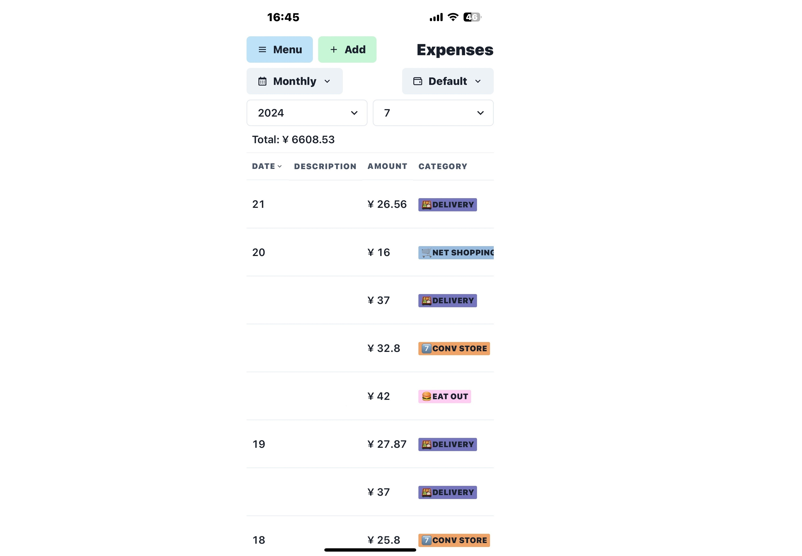
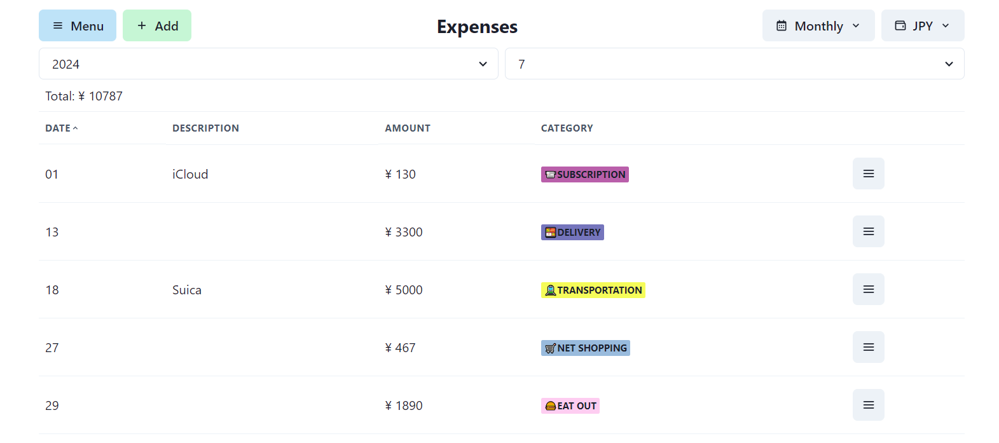
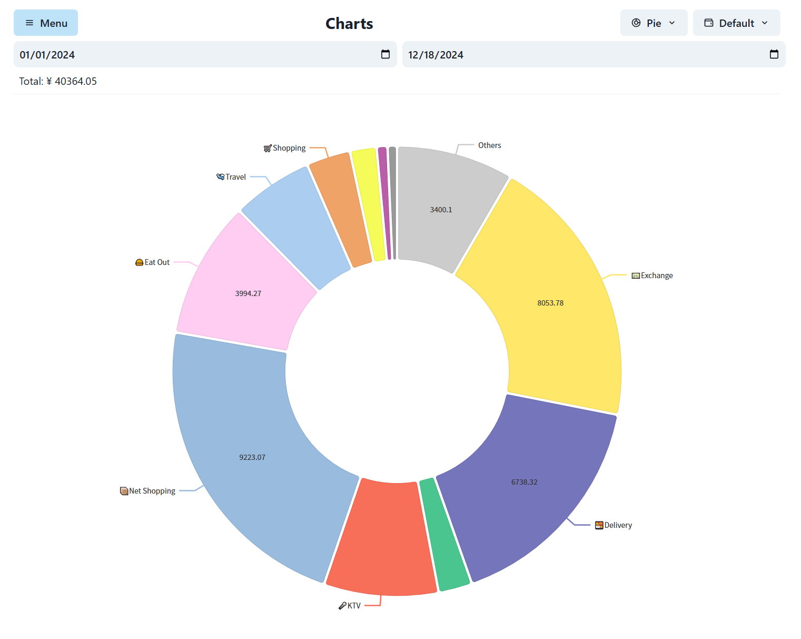

# Pockewallet

A simple PWA to track your expenses.

## Features

- Expense records with amount, time, and category.
- Customizable categories.
- Multiple wallets management.
- Recurring expenses with automatic tracking.
- View by day/month/year/search.
- Pie chart view.
- Data sync (push/pull) with optional backend.

## Screenshots







## Development

### Prerequisites

- [Node.js](https://nodejs.org/) (v18+)

### Setup

```bash
npm install
```

Create a `.env` file (optional, for backend sync):

```
VITE_BACKEND_ENDPOINT=http://localhost:8080
VITE_OAUTH_ENDPOINT=http://localhost:9090
VITE_CLIENT_ID=your-client-id
```

### Dev server

```bash
npm run dev
```

This starts Vite at `http://localhost:5173` with HMR. API requests to `/api/*` are proxied to `VITE_BACKEND_ENDPOINT`.

### Build

```bash
npm run build
```

Output goes to `dist/`. The build includes:

- Compiled TypeScript + React via Vite
- Static assets from `public/` (icons, manifest, service worker)

### PWA

The PWA is implemented manually without plugins:

- **`public/manifest.json`** — web app manifest (name, icons, display mode)
- **`public/sw.js`** — service worker (network-first caching, offline fallback)
- **`index.html`** — registers the service worker and links the manifest

To update the service worker cache version, change `CACHE_NAME` in `public/sw.js`.

### Lint / Format

```bash
npm run fix
```

Uses [Biome](https://biomejs.dev/) for linting and formatting.
